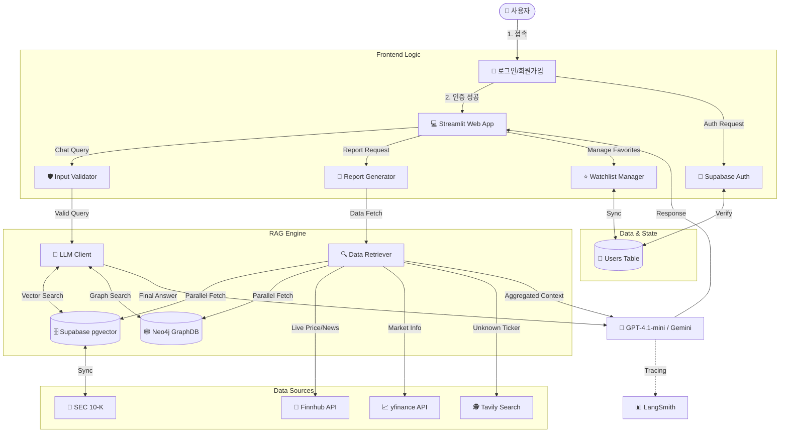
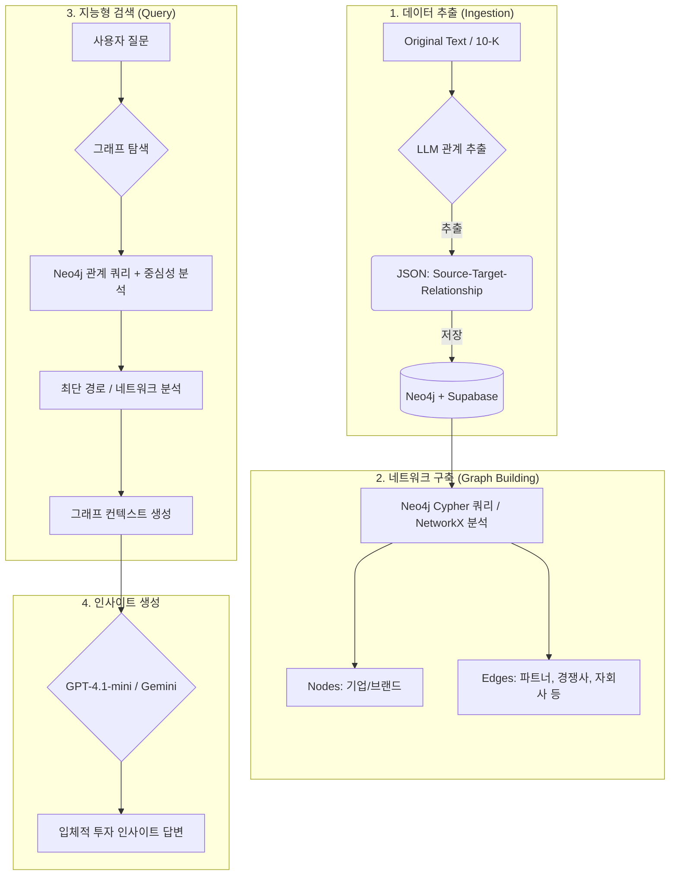

# 02. 시스템 아키텍처 (System Architecture)

## 📌 개요
본 프로젝트는 **Hybrid RAG (Vector Search + Graph Analysis)** 기반의 금융 분석 챗봇 시스템입니다.

## 🏗️ 전체 아키텍처



### 1. Frontend (User Interface)
- **Framework**: Streamlit
- **Features**: 
  - 실시간 채팅 인터페이스 (`AnalystChatbot`)
  - 대화형 차트 및 데이터 시각화
  - 사용자 및 관심 기업 관리 (Sidebar)

### 2. Backend & AI Engine
- **RAG Engine**:
  - **Vector Store**: 텍스트 의미 검색 (Semantic Search)
  - **GraphRAG**: **Neo4j** Cypher 쿼리 + `NetworkX` 기반 기업 관계망 분석
  - **Hybrid Retrieval**: 벡터 검색 결과와 그래프 분석 결과를 결합하여 답변 생성
- **LLM**: GPT-4.1-mini 기본 / Gemini 2.5 Flash 선택적 (`.env`로 전환)
- **LLM Client**: `llm_client.py` — Gemini/OpenAI 통합 추상화 레이어
- **LangSmith**: LLM 콜 트레이싱 및 모니터링 (선택적)

### 3. Database & Infrastructure
- **Supabase (PostgreSQL)**:
  - `pgvector`: 벡터 임베딩 저장 및 검색
  - `Relational Tables`: 기업 정보, 사용자 정보, 관계 데이터 관리
- **Neo4j**: 기업 관계망 그래프 DB (614노드, 212관계)
- **Authentication**: Supabase Auth

## 🔄 데이터 흐름 (Data Flow)

1. **User Query**: 사용자가 질문 입력 (예: "애플의 공급망 리스크는?")
2. **Intent Analysis**: 질문 의도 파악 (일반 대화 vs 분석 요청)
3. **Information Retrieval**:
   - **Vector Search**: 관련 뉴스/보고서 검색 (`documents`)
   - **Graph Search**: 관련 기업 네트워크 및 관계 탐색 (`company_relationships`)
4. **Context Assembly**: 검색된 텍스트와 그래프 정보를 프롬프트로 구성
5. **Generation**: LLM이 분석 결과 생성 및 답변 제공

---

## 🕸️ GraphRAG: 지능형 관계망 분석

단순한 텍스트 검색(Vector RAG)을 넘어, 기업 간의 **공급망(Supply Chain), 경쟁 구도, 지배 구조**를 연결하여 입체적인 분석을 제공합니다.

### GraphRAG 작동 원리 (Architecture)


### 주요 기능

- **관계망 추론**: 특정 기업의 악재가 공급망 내 어떤 기업에 파급될지 분석합니다.
- **네트워크 위치 분석**: NetworkX의 `Centrality(중심성)` 알고리즘을 사용하여 시장 내 핵심 기업을 식별합니다.
- **다차원 컨텍스트**: 벡터 검색 결과와 그래프 분석 결과를 결합하여 정보의 누락 없는 답변을 생성합니다.

---

## 🛠️ 기술 스택 (Tech Stack)
- **Language**: Python 3.10+
- **LLM**: GPT-4.1-mini (기본) / Gemini 2.5 Flash (선택)
- **Graph DB**: Neo4j (Cypher) + NetworkX (분석)
- **Vector DB**: Supabase pgvector
- **Tracing**: LangSmith (선택적)
- **Key Libraries**: `google-generativeai`, `openai`, `neo4j`, `supabase`, `networkx`, `streamlit`

## 📂 프로젝트 구조 (Directory Structure)

```bash
SKN22-3rd-4Team/
├── scripts/                    # 유틸리티 및 배치 스크립트
│   ├── build_company_relationships.py  # [ETL] 기업 관계 추출
│   └── migrate_to_neo4j.py            # Supabase → Neo4j 마이그레이션
├── src/
│   ├── core/                   # 코어 로직 (Validator, ChatConnector)
│   ├── data/                   # 데이터 클라이언트 (Finnhub, Supabase)
│   ├── rag/                    # RAG 엔진
│   │   ├── analyst_chat.py     # 챗봇 비즈니스 로직
│   │   ├── chat_tools.py       # 도구 정의 + ToolExecutor
│   │   ├── graph_rag.py        # [CORE] Neo4j + NetworkX 그래프 분석
│   │   ├── llm_client.py       # [NEW] 통합 LLM Client (Gemini/OpenAI)
│   │   ├── rag_base.py         # RAG 기본 클래스 (LangSmith 트레이싱)
│   │   └── vector_store.py     # 벡터 검색
│   ├── tools/                  # 환율, 즐겨찾기 등
│   └── ui/                     # Streamlit 페이지 및 헬퍼
├── app.py                      # 메인 애플리케이션
├── .env                        # 환경 변수 (Gemini, OpenAI, Neo4j 등)
└── requirements.txt            # 의존성 패키지
```
