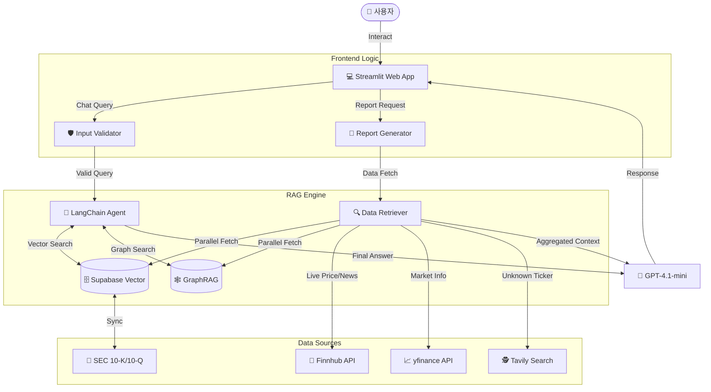
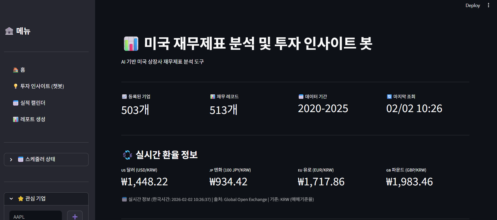
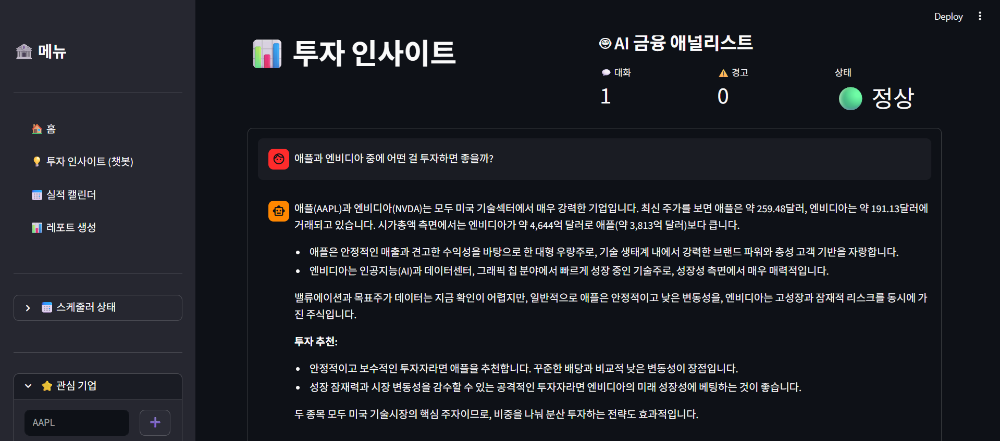
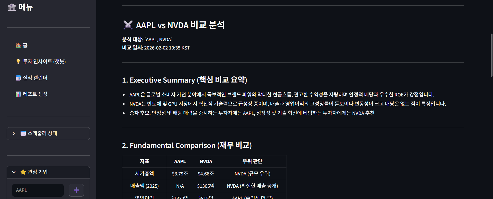
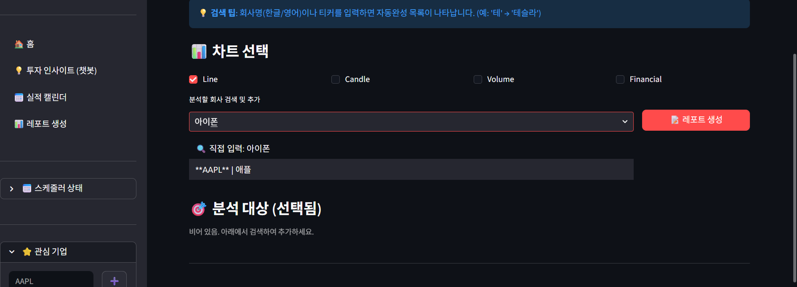

# 📊 미국 재무제표 분석 및 투자 인사이트 봇

> AI 기반 미국 상장사 재무제표 분석 및 투자 조언 플랫폼

## 🎯 프로젝트 목표

미국 상장 기업의 방대한 재무 데이터와 시장 정보를 AI로 분석하여, 투자자에게 실질적인 인사이트를 제공하는 대화형 플랫폼을 구축합니다.

## 🙋‍♂️ 팀 구성

- 안민제, 이신재, 이병재, 장완식

### 핵심 기능

1. **💬 AI Financial Analyst**: Finnhub 실시간 데이터와 내부 재무 DB를 결합한 RAG 챗봇 (병렬 수집 최적화로 빠른 응답)
2. **📝 투자 리포트 + 주가 차트**: 단일/비교 분석 레포트 생성 + 3개월 주가 추이 차트 (`gpt-4.1-mini`, 한글명 검색)
3. **📈 한국형 마켓 대시보드**: KST 기준 실시간 원화(KRW) 환율 및 주요 지표 제공
4. **⭐ 사이드바 관심기업 Quick Add**: 어디서든 티커/한글명으로 즐겨찾기 추가 (DB 검증)
5. **🔍 Text-to-SQL**: 자연어 질의를 통한 복잡한 재무 재표 검색
---

## 🏗️ 시스템 아키텍처



---
## 📚 기술 스택


---

## 📸 주요 기능 및 실행 화면

### 1. 📊 메인 대시보드 (Home)
KST 기준 실시간 환율 정보와 관심 기업(Watchlist)을 한눈에 확인할 수 있습니다.


### 2. 💬 AI 애널리스트 채팅 (RAG Chatbot)
재무제표 DB와 실시간 뉴스 데이터를 기반으로 사용자의 투자 질문에 답변합니다. (출처 포함)


### 3. 📝 심층 투자 리포트 (Report Generator)
단일 기업 분석부터 다중 기업 비교까지, 전문가 수준의 PDF 리포트를 원클릭으로 생성합니다.
- **특징**: 주가 차트, 거래량, 재무 지표 시각화 포함


### 4. 🔍 지능형 티커 검색
"아이폰"을 검색하면 모기업 "AAPL"를 찾아주는 인공지능 검색 기능을 제공합니다.


---

## ✅ 진행 상황

### Phase 1: 기본 인프라 구축 ✅ 완료

- [x] Streamlit 기반 반응형 웹 UI
- [x] 다크/라이트 모드 지원
- [x] 모듈화된 프로젝트 구조 설계

### Phase 2: 데이터 파이프라인 ✅ 완료

- [x] **Supabase**: 503개 주요 기업 재무 데이터(10-K, 10-Q) DB 구축
- [x] **Finnhub API**: 실시간 주가, 뉴스, 컨센서스 데이터 연동
- [x] **Exchange API**: KST 기준 실시간 원화 환율 연동 완료

### Phase 3: AI 및 RAG 엔진 ✅ 완료

- [x] **Vector Store**: Supabase pgvector 기반 문서 검색
- [x] **GraphRAG**: NetworkX 기반 기업 관계망 분석
- [x] **Performance**: `DataRetriever` 도입으로 병렬 데이터 수집 최적화 완료

### Phase 4: 폴리싱 및 배포 🔄 진행 중

- [x] 챗봇 및 레포트 생성 속도 최적화
- [x] **UI 가독성 향상**: 채팅 폰트 확대, 컨테이너 높이 확장 (800px), 차트 가시성 개선
- [x] **PDF 레포트 고도화**: 다중 차트(캔들스틱, 거래량, 재무) 지원 및 자동 이미지 임베딩
- [x] **차트 기능 확장**: Plotly(웹) 및 Matplotlib(PDF) 기반 다양한 차트 시각화 추가
- [x] **성능 최적화**: 홈 화면 데이터 캐싱 적용 (`st.cache_data`)
- [x] 프로젝트 문서 및 의존성 파일 정리 완료
- [ ] 사용자 맞춤형 포트폴리오 관리 (예정)

---

## 🗂 프로젝트 구조 (요약)

상세 구조는 [STRUCTURE.md](./STRUCTURE.md)를 참조하세요.

```text
SKN22-3rd-4Team/
├── app.py                    # Main Entory Point
├── config/                   # Global Settings
├── src/
│   ├── core/                 # Core Logic (Validator)
│   ├── data/                 # API Clients (Finnhub, Supabase)
│   ├── rag/                  # RAG Engine (Chat, Report, Graph)
│   ├── tools/                # Agent Tools
│   ├── ui/                   # Streamlit Pages & Helpers
│   └── utils/                # Utilities (Charts, PDF)
└── .env                      # API Keys
```

---

## 🔧 설치 및 실행

### 1. 환경 설정

```bash
# 가상환경 생성 (권장)
conda create -n finance_bot python=3.12
conda activate finance_bot

# 의존성 설치
pip install -r requirements.txt
```

### 2. 환경 변수 설정 (.env)

OPENAI_API_KEY=sk-...
SUPABASE_URL=https://...
SUPABASE_KEY=eyJ...
FINNHUB_API_KEY=...
TAVILY_API_KEY=...
```

### 3. 앱 실행
streamlit run app.py
```

---

## 🌐 API 및 서비스

| 서비스 | 용도 | 상태 |
| :--- | :--- | :--- |
| **Supabase** | 재무제표 DB & Vector Store | ✅ 연동 완료 |
| **Finnhub** | 실시간 주가, 뉴스, 재무 지표 | ✅ 연동 완료 |
| **yfinance** | 주가 추이, 목표주가 (Finnhub fallback) | ✅ 연동 완료 |
| **OpenAI** | LLM (Chat, Report, SQL) | ✅ 연동 완료 |

> **Note**: Finnhub 무료 플랜에서 제한되는 `stock/candle`(주가 추이), `stock/price-target`(목표주가)은 yfinance로 자동 fallback됩니다.

---

## 🛠️ 트러블슈팅 및 기술적 도전

> ### ⚡ Challenge: LLM의 티커(Ticker) 환각(Hallucination) 문제

**문제 상황 (Problem):**
사용자가 "액티비전" 같은 기업명/관련 검색어를 입력했을 때, LLM이 이미 상장 폐지된 티커(`ATVI`)나 엉뚱한 티커를 반환하여 데이터 조회 에러가 발생했습니다.
(참고: 액티비전 블리자드는 마이크로소프트에 인수합병되어 MSFT로 변경되었습니다)

**해결 과정 (Solution):**
1. **DB 기반 자동완성**: 1차적으로 내부 DB(`companies` 테이블)와 매핑된 키워드로 빠르고 정확한 자동완성을 제공했습니다.
2. **지능형 웹 검색 (Agent Fallback)**: DB에 없는 키워드("액티비전" 등)가 입력되면, **Tavily Search API**를 활용한 에이전트가 실시간으로 웹을 검색합니다.
   - *"이 키워드를 만든 회사의 현재 상장 티커는 무엇인가?"*
   - *"혹시 인수합병(M&A)되었는가?"* (예: 액티비전 블리자드(ATVI) -> MSFT)
3. **사용자 피드백 루프**: 시스템이 티커를 대체할 경우, UI에 **"이유(Reason)"**를 명시하여 사용자의 혼란을 방지했습니다.

**결과 (Impact):**
- 정확하지 않은 티커로 인한 크래시 **<1%**
- "오버워치" 같은 게임 이름이나, "Windows" 같은 OS 이름으로도 모기업(MSFT) 분석이 가능한 **유연한 검색 경험** 구현

> ### ⚡ Challenge: finnhub api의 요청 횟수 제한으로 인한 데이터 수집 실패 문제와 데이터 수집 속도 문제

**문제 상황 (Problem):**
Finnhub API는 무료 플랜에서는 일일 요청 횟수에 제한이 있습니다. 이로 인해 여러 기업의 데이터를 동시에 수집하거나, 사용자가 여러 번 요청을 보낼 경우 데이터 수집이 실패하는 문제가 발생했습니다. 또한, Finnhub API의 응답 속도가 느려 데이터 수집 시간이 오래 걸리는 문제가 있었습니다.

**해결 과정 (Solution):**
1. **병렬 수집 최적화**: `DataRetriever` 클래스를 도입하여 여러 기업의 데이터를 동시에 수집할 수 있도록 개선했습니다. 이를 통해 API 요청 횟수를 줄이고 데이터 수집 속도를 높였습니다.
2. **Fallback 메커니즘**: Finnhub API에서 데이터를 가져오지 못할 경우, `yfinance` 라이브러리를 사용하여 대체 데이터를 수집하도록 구현했습니다. 이를 통해 데이터 수집 실패율을 낮추고 사용자 경험을 개선했습니다.

**결과 (Impact):**
- Fallback 메커니즘으로 데이터 수집 실패율 감소
- 데이터 병렬 수집으로 데이터 수집 속도 향상

---

## 📝 라이선스
MIT License
