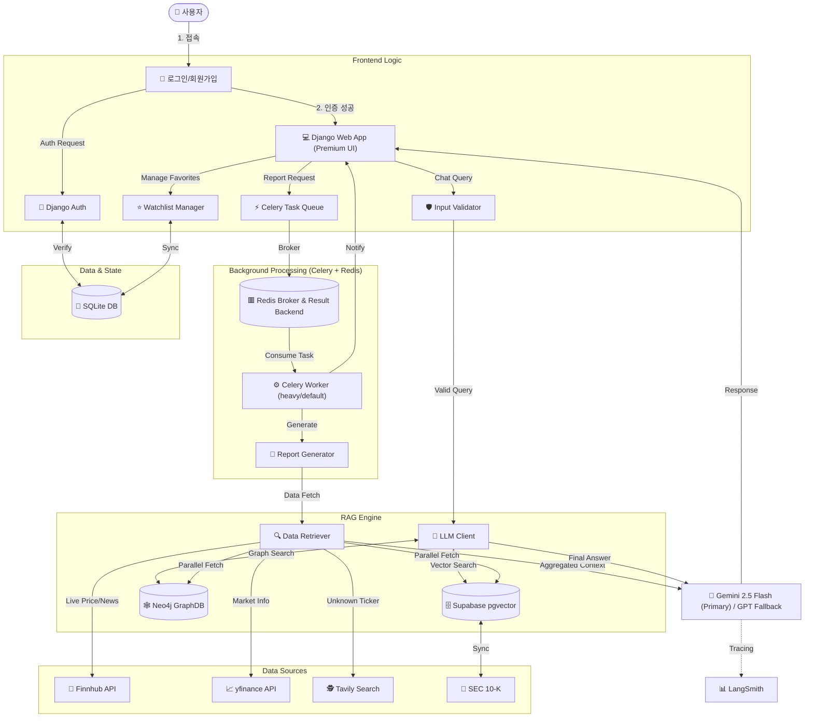
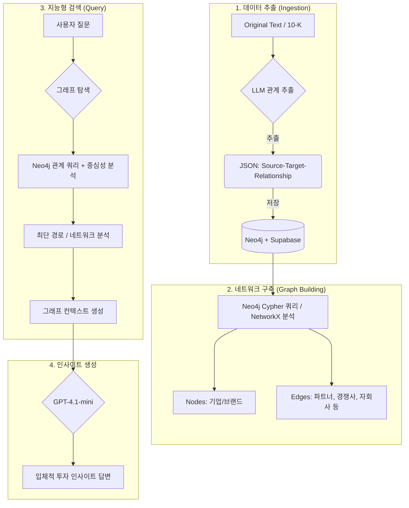
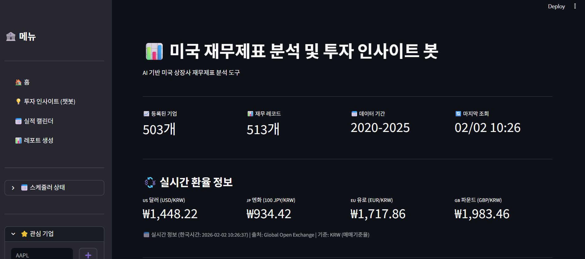
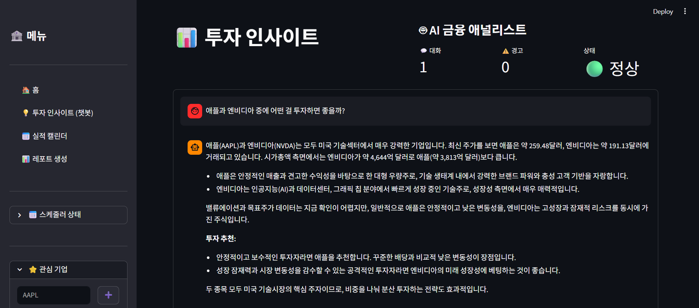
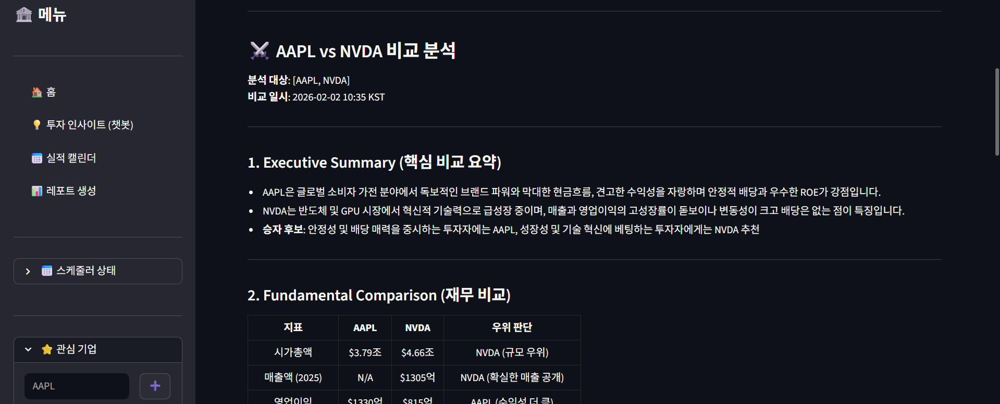
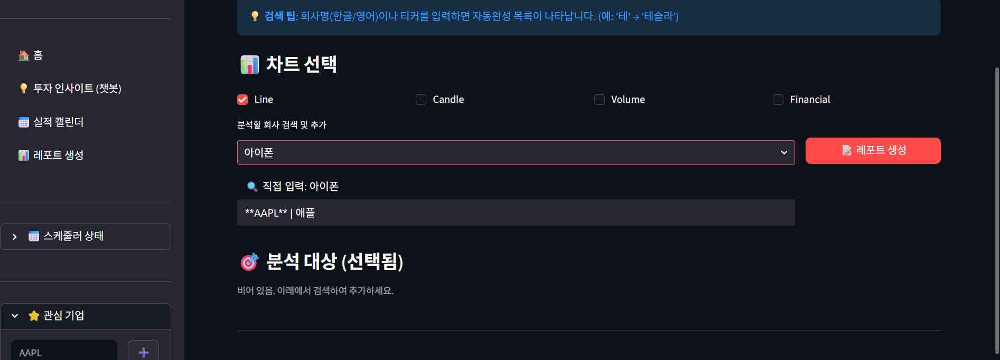

# 📊 StockPulse AI Finance

> AI 기반 미국 상장사 재무제표 분석 및 투자 조언 플랫폼

## 🎯 프로젝트 목표

미국 상장 기업의 방대한 재무 데이터와 시장 정보를 AI로 분석하여, 투자자에게 실질적인 인사이트를 제공하는 대화형 플랫폼을 구축합니다.

## 🙋‍♂️ 프로젝트 팀 구성 (Team Composition)

| Role & Name | Responsibilities | Comment |
| :--- | :--- | :--- |
| **이병재 (Team Leader / Architect)**<br>[@PracLee](https://github.com/PracLee) | • Celery + Redis Async Task 파이프라인 구축<br>• Django SSE 기반 실시간 AI 스트리밍 개발<br>• 소셜 인증 및 다중 유저 시스템 구축 | Backend쪽을 더 많이 만져본것같은데 다음 프로젝트에서는 LLM쪽을 더 만져보고 싶다. |
| **장완식 (AI Engineer / Backend)**<br>[@JangWS1030](https://github.com/JangWS1030) | • Django MVT 웹 서비스 아키텍처 설계<br>• GraphRAG 및 벡터 검색 엔진 통합<br>• RAG 시스템 평가지표 수립 및 품질 검수<br>• Neo4j 그래프 데이터베이스 모델링 | 이번 프로젝트는 다양한 기술 스택을 활용해 볼 수 있어 다방면으로 배운 점이 많은 의미 있는 시간이었습니다. Django 설정부터 Neo4j를 활용한 DB 연동, 성능 향상을 위한 캐싱 적용, 그리고 실제 배포 과정까지 전체적인 파이프라인을 직접 경험하고 해결해 나간 과정이 개인적으로 매우 재밌고 뜻깊었습니다. |
| **안민제 (Frontend Developer)**<br>[@minje0209-ux](https://github.com/minje0209-ux) | • Vanilla JS 기반 동적 렌더링 최적화<br>• Plotly 활용 금융 데이터 시각화<br>• 글로벌 테마(Dark/Light) 스위처 시스템<br>• UI/UX 인터페이스 설계 및 고도화 | |
| **이신재 (Testing / UI / QA)**<br>[@Codingcooker74](https://github.com/Codingcooker74) | • 시스템 통합 테스트 및 기능 명세 검증<br>• UI/UX 사용성 테스트 및 피드백 도출<br>• 데이터 무결성 검증 및 예외 테스팅<br>• 최종 프로덕트 품질 관리 및 QA | 기술적 확장 팩키지에 대해 많은 것을 알게 되었서 의미있는 프로젝트였다. 보다 기술적으로 많은 것을 알 수 있도록 노력해야 겠다. 또한 웹 프로그램의 처음부터 끝까지 모든 것을 이해하고 실행 할 수 있도록 시도해야겠습니다. 모두 고생하셨습니다. 감사합니다. |

## 🖐️ 핵심 기능

1. **💬 AI Financial Analyst**: Finnhub 실시간 데이터와 내부 재무 DB를 결합한 RAG 챗봇 (병렬 수집 최적화로 빠른 응답)
2. **📝 투자 리포트 + 주가 차트**: 단일/비교 분석 레포트 생성 + 3개월 주가 추이 차트 (`Gemini 2.5 Flash` 기반)
3. **📈 한국형 마켓 대시보드**: KST 기준 실시간 원화(KRW) 환율 및 주요 지표 제공
4. **⭐ 사이드바 관심기업 Quick Add**: 어디서든 티커/한글명으로 즐겨찾기 추가 (DB 검증 + 한글/비기업 입력 차단)
5. **🔍 Text-to-SQL**: 자연어 질의를 통한 복잡한 재무 재표 검색
6. **🕸️ Neo4j GraphRAG**: 기업 관계망을 그래프 DB로 관리, Cypher 쿼리 기반 분석
7. 📰 **FinBERT 감성 분석 파이프라인**: GraphRAG와 연계한 심층 감성 분석 (Financial PhraseBank 97% 정확도 검증, `NewsAnalyzerService`)
8. ⚡ **비동기 백그라운드 처리 (Celery + Redis)**: AI 리포트 생성, 뉴스 감성 분석 등 무거운 작업을 백그라운드에서 병렬 처리하여 타임아웃 방지 및 UI 응답성 극대화
9. 🔔 **인앱 알림 시스템**: 관심 기업 가격 변동 및 AI 리포트 생성 완료 알림 (bell dropdown + 읽음 처리)
10. ✨ **SSE 실시간 스트리밍**: Server-Sent Events 기반 실시간 AI 응답 렌더링 (Markdown + Plotly 차트 + 추천질문)

---

## 🏗️ 시스템 아키텍처


```mermaid
graph TD
    User(["👤 사용자"]) -->|1. 접속| Login["🔐 로그인/회원가입"]
    Login -->|2. 인증 성공| UI["💻 Django Web App (Premium UI)"]
    
    subgraph Frontend Logic
        Login -->|Auth Request| Auth["🔐 Django Auth"]
        UI -->|Chat Query| Validator["🛡️ Input Validator"]
        UI -->|Report Request| ReportTask["⚡ Celery Task Queue"]
        UI -->|Manage Favorites| Watchlistmgr["⭐ Watchlist Manager"]
    end

    subgraph "Background Processing (Celery + Redis)"
        ReportTask -->|Broker| Redis[("🟥 Redis Broker & Result Backend")]
        Redis -->|Consume Task| CeleryWorker["⚙️ Celery Worker (heavy/default)"]
        CeleryWorker -->|Generate| ReportGen["📝 Report Generator"]
        CeleryWorker -->|Notify| UI
    end

    subgraph "Data & State"
        Auth <-->|Verify| UserDB[("👥 SQLite DB")]
        Watchlistmgr <-->|Sync| UserDB
    end

    subgraph RAG Engine
        Validator -->|Valid Query| Agent["🤖 LLM Client"]
        ReportGen -->|Data Fetch| Retriever["🔍 Data Retriever"]
        
        Agent <-->|Vector Search| VectorDB[("🗄️ Supabase pgvector")]
        Agent <-->|Graph Search| GraphDB[("🕸️ Neo4j GraphDB")]
        
        Retriever -->|Parallel Fetch| VectorDB
        Retriever -->|Parallel Fetch| GraphDB
    end

    subgraph Data Sources
        Retriever -->|Live Price/News| Finnhub["📡 Finnhub API"]
        Retriever -->|Market Info| Yahoo["📈 yfinance API"]
        Retriever -->|Unknown Ticker| Tavily["🕵️ Tavily Search"]
        VectorDB <-->|Sync| SEC["📄 SEC 10-K"]
    end

    Retriever -->|Aggregated Context| LLM["🧠 Gemini 2.5 Flash (Primary) / GPT Fallback"]
    Agent -->|Final Answer| LLM
    LLM -->|Response| UI
    LLM -.->|Tracing| LS["📊 LangSmith"]
```

---

## 🕸️ GraphRAG: 지능형 관계망 분석

단순한 텍스트 검색(Vector RAG)을 넘어, 기업 간의 **공급망(Supply Chain), 경쟁 구도, 지배 구조**를 연결하여 입체적인 분석을 제공합니다.

### 1. GraphRAG 작동 원리 (Architecture)


```mermaid
graph TD
    subgraph "1. 데이터 추출 (Ingestion)"
        A[Original Text / 10-K] --> B{LLM 관계 추출}
        B -- "추출" --> C(JSON: Source-Target-Relationship)
        C -- "저장" --> D[(Neo4j + Supabase)]
    end

    subgraph "2. 네트워크 구축 (Graph Building)"
        D --> E[Neo4j Cypher 쿼리 / NetworkX 분석]
        E --> F[Nodes: 기업/브랜드]
        E --> G[Edges: 파트너, 경쟁사, 자회사 등]
    end

    subgraph "3. 지능형 검색 (Query)"
        H[사용자 질문] --> I{그래프 탐색}
        I --> J[Neo4j 관계 쿼리 + 중심성 분석]
        J --> K[최단 경로 / 네트워크 분석]
        K --> L[그래프 컨텍스트 생성]
    end

    subgraph "4. 인사이트 생성"
        L --> M{GPT-4.1-mini}
        M --> N[입체적 투자 인사이트 답변]
    end
```

### 2. 주요 기능

- **관계망 추론**: 특정 기업의 악재가 공급망 내 어떤 기업에 파급될지 분석합니다.
- **네트워크 위치 분석**: NetworkX의 `Centrality(중심성)` 알고리즘을 사용하여 시장 내 핵심 기업을 식별합니다.
- **다차원 컨텍스트**: 벡터 검색 결과와 그래프 분석 결과를 결합하여 정보의 누락 없는 답변을 생성합니다.

---

## 🛡️ 보안 및 안전성 (Security & Reliability)

사용자 정보 보호와 시스템 무결성을 위해 **3단계 보안 레이어**를 구축하였습니다.

- **Layer 1 (Gateway)**: 요청 속도 제한(Rate Limit) 및 반복 공격 세션 자동 차단.
- **Layer 2 (Validator)**: 코드 레벨의 프롬프트 인젝션 패턴 탐지 및 입력 정제.
- **Layer 3 (Guard)**: 시스템 프롬프트 하드닝(Hardening)을 통한 페르소나 이탈 방지.

> [상세 보안 가이드 확인하기](./docs/SECURITY_SYSTEM.md)

---

## 📚 기술 스택


---

## 📸 주요 기능 및 실행 화면

### 1. 🔐 로그인 및 회원가입 (Auth)

안전한 계정 관리를 기반으로 사용자 인증 및 즐겨찾기 연동 기능을 제공합니다.


### 2. 📊 메인 대시보드 (Home)

KST 기준 실시간 환율 정보와 관심 기업(Watchlist)을 한눈에 확인할 수 있습니다.


### 3. 💬 AI 애널리스트 채팅 (RAG Chatbot)

재무제표 DB와 실시간 뉴스 데이터를 기반으로 사용자의 투자 질문에 답변합니다. (출처 포함)


### 4. 📝 심층 투자 리포트 (Report Generator)

단일 기업 분석부터 다중 기업 비교까지, 전문가 수준의 PDF 리포트를 원클릭으로 생성합니다.

**특징**: 주가 차트, 거래량, 재무 지표 시각화 포함


### 5. 🔍 지능형 티커 검색

"아이폰"을 검색하면 모기업 "AAPL"를 찾아주는 자동완성 검색 기능을 제공합니다.


---

## ✅ 진행 상황

### Phase 1: 기본 인프라 구축 ✅ 완료

- [x] 백엔드 기반 반응형 웹 UI 설계
- [x] 다크/라이트 모드 지원
- [x] 모듈화된 프로젝트 구조 설계

### Phase 2: 데이터 파이프라인 ✅ 완료

- [x] **Supabase**: 503개 주요 기업 재무 데이터(10-K, 10-Q) DB 구축
- [x] **Finnhub API**: 실시간 주가, 뉴스, 컨센서스 데이터 연동
- [x] **Exchange API**: KST 기준 실시간 원화 환율 연동 완료

### Phase 3: AI 및 RAG 엔진 ✅ 완료

- [x] **Vector Store**: Supabase pgvector 기반 문서 검색
- [x] **GraphRAG**: Neo4j 기반 기업 관계망 분석 (NetworkX 폴백)
- [x] **Performance**: `DataRetriever` 도입으로 병렬 데이터 수집 최적화 완료
- [x] **Evaluation**: `Ragas` 프레임워크를 활용한 RAG 성능 정량 평가 및 [결과 리포트](./04_test_plan_results/02_RAG_Evaluation_Result.md) 작성 완료

### Phase 4: Gemini + Neo4j 마이그레이션 ✅ 완료

- [x] **Gemini 2.5 Flash**: 채팅/분석 LLM을 OpenAI에서 Gemini로 전환 가능 (`.env`로 설정)
- [x] **OpenAI 임베딩 유지**: text-embedding-3-small 유지 (재벡터화 불필요)
- [x] **Neo4j 도입**: 기업 관계 데이터를 그래프 DB로 마이그레이션 (614노드, 212관계)
- [x] **LangSmith 트레이싱**: RAG 파이프라인 모니터링 및 디버깅
- [x] **통합 LLM Client**: Gemini/OpenAI 자동 전환 (`llm_client.py`)
- [x] **ToolExecutor 분리**: 도구 실행 로직 모듈화 (`chat_tools.py`)

### Phase 5: Django + Premium UI 마이그레이션 ✅ 완료

- [x] **웹 프레임워크 전환**: 기존 Streamlit 프로토타입을 Django 기반의 안정적인 웹 애플리케이션으로 완전 전환
- [x] **Glassmorphism UI**: 투명하고 입체적인 프리미엄 다크/라이트 테마 (Theme Switcher) 도입
- [x] **Gemini 스마일 챗봇**: Neo4j 통합 RAG 챗봇을 Gemini 스타일의 Flexbox 기반 대화형 레이아웃으로 개편
- [x] **동적 차트 통합**: 백엔드에서 생성된 Plotly JSON을 프론트엔드 JS로 렌더링, 라인/캔들/거래량/재무 차트 등 사용자 선택 인터페이스 추가

### Phase 6: FinBERT Sentiment Analysis & Optimization ✅ 완료

- [x] **FinBERT 통합**: 97% 정확도(Financial PhraseBank) 및 98% F1-Score의 금융 텍스트 특화 NLP 감성 분석(ProsusAI/FinBERT) 파이프라인 구축
- [x] **GraphRAG 융합**: Neo4j 트래버설을 통해 원본 질의 대상 기업뿐 아니라 공급망 상의 핵심 벤더/파트너의 부정/긍정 뉴스까지 포괄 분석
- [x] **자동화 스케줄링**: `subprocess.run` 기반으로 메모리 안정성을 확보한 `sp500_scheduler`에 매일 06:00(KST) 파이프라인 자동 적재 등록
- [x] **비즈니스 모듈화**: `NewsAnalyzerService` 로 결합도 낮은 재사용성 서비스 추상화 구축

### Phase 7: SSE 스트리밍 & 인앱 알림 & 유효성 강화 ✅ 완료

- [x] **SSE 스트리밍 챗봇**: `StreamingHttpResponse` + `chat_stream` 제너레이터로 실시간 응답 (chunk/chart/recommendations/done 이벤트)
- [x] **인앱 알림 시스템**: Navbar 벨 아이콘 + 드롭다운 알림 목록 + 읽음 처리 API
- [x] **멀티 티커 비교 분석**: 프롬프트 강화 + 비교 분석 힌트로 복수 기업 감정/재무 비교
- [x] **관심기업 유효성 검증**: `isascii()` 검증으로 한글/비기업 입력 차단 + 에러 메시지 UI
- [x] **LLM 파싱 강화**: 4단계 폴백 JSON 파서 구현 (긴 마크다운 응답 대응)

### Phase 8: 비동기 백그라운드 처리 개편 (Celery + Redis) ✅ 완료

- [x] **메시지 브로커 연동**: Redis를 활용한 작업 대기열 및 Task 상태 관리 백엔드 구축
- [x] **비동기 큐잉 시스템**: Report 생성 및 분석 로직 등 무거운 I/O 작업을 Celery 다중 큐(heavy, default)로 분리 처리
- [x] **사용자 경험(UX) 개선**: 긴 대기 시간으로 인한 요청 타임아웃 문제를 해결하고, 백그라운드 작업 완료 시 실시간 알림 시스템과 결합하여 응답성 극대화
- [x] **OS 호환성 확보**: Windows 환경에서의 Celery thread pool 호환성 이슈 해결 (`--pool=threads`)

---

## 🗂 프로젝트 구조 (요약)

상세 구조는 [STRUCTURE.md](./STRUCTURE.md)를 참조하세요.

```text
SKN22-4th-4Team/
├── config/                   # Django Settings & Routing
├── finance_app/              # Main Django App (Views, Templates, URLs)
├── static/                   # CSS (Premium Theme), JS, Images
├── src/                      # Core Logic & RAG Engine
│   ├── core/                 # Core Logic (Validator, ChatConnector)
│   ├── data/                 # API Clients (Finnhub, Supabase, SEC)
│   ├── prompts/              # System & Chat Prompts
│   ├── rag/                  # RAG Engine (Chat, Report, Graph, LLM Client)
│   ├── sql/                  # SQL Modules
│   ├── tools/                # Agent Tools (Exchange, Favorites)
│   └── utils/                # Utilities (Charts, PDF, Ticker Resolver)
├── scripts/                  # ETL & Batch Scripts (Scheduler, Migration)
├── docs/                     # Documentation & Images
├── logs/                     # Application & Celery Worker Logs
├── .env                      # API Keys (gitignored)
├── docker-compose.yml        # Docker Containers (Redis, Celery)
└── requirements.txt          # Dependencies
```

---

## 🔧 설치 및 실행

### 1. 환경 설정

```bash
# 가상환경 생성 (권장)
conda create -n finance_bot python=3.12
conda activate finance_bot

# 의존성 설치 (Redis, Celery 포함)
pip install -r requirements.txt
```

> **FinBERT 모델 (자동 다운로드)**: 첫 실행 시 `ProsusAI/finbert` 모델이 HuggingFace Hub에서 자동 다운로드됩니다 (~400MB). 오프라인 환경에서는 사전 다운로드가 필요합니다.

### 2. 백그라운드 Worker 실행 (선택: Redis + Celery)

빠른 분석 속도(비동기 모드)를 사용하려면 백그라운드 워커를 가동해야 합니다. **가동하지 않아도 동기 방식으로 정상 작동합니다.**

**[옵션 1] 원클릭 실행 스크립트 (권장)**

- 🍎 **Mac/Linux**: `bash scripts/start_dev.sh`
- 🪟 **Windows**: `scripts\start_dev.bat`

**[옵션 2] 수동 실행**

1. **Redis 서버 실행**
   - **Mac**: `brew services start redis`
   - **Windows**: `docker run -d --name redis -p 6379:6379 redis:7-alpine`

2. **새 터미널/CMD 창을 열고 Celery Worker 실행**:

   ```bash
   celery -A config worker --loglevel=info --queues=heavy,default --pool=threads
   ```

### 2. 환경 변수 설정 (.env)

```
# LLM (기본: OpenAI)
LLM_PROVIDER=openai
CHAT_MODEL=gpt-4.1-mini
REPORT_MODEL=gpt-4.1-mini

# OpenAI (필수)
OPENAI_API_KEY=sk-...

# Gemini (선택 — LLM_PROVIDER=gemini로 변경 시 필요)
# GOOGLE_API_KEY=your-google-api-key

# Supabase (필수 - 데이터베이스)
SUPABASE_URL=https://...
SUPABASE_KEY=eyJ...

# Neo4j (그래프 DB)
NEO4J_URI=neo4j+s://...
NEO4J_USER=neo4j
NEO4J_PASSWORD=...

# Finnhub (실시간 주가)
FINNHUB_API_KEY=...

# LangSmith (선택 — 트레이싱)
# LANGSMITH_TRACING=true
# LANGSMITH_API_KEY=lsv2_...
# LANGSMITH_PROJECT=SKN22-3rd-4Team
```

### 3. 앱 실행

```bash
python manage.py migrate
python manage.py runserver
```

> 서버 구동 후 `http://127.0.0.1:8000` 접속

---

## 🌐 API 및 서비스

| 서비스 | 용도 | 상태 |
| :--- | :--- | :--- |
| **OpenAI** | LLM (Chat, Report, Embeddings) | ✅ 연동 완료 |
| **Google Gemini** | LLM 대안 (선택적, `.env` 설정) | ✅ 연동 완료 |
| **Neo4j** | 그래프 DB (기업 관계망) | ✅ 연동 완료 |
| **Supabase** | 재무제표 DB & Vector Store | ✅ 연동 완료 |
| **Finnhub** | 실시간 주가, 뉴스, 재무 지표 | ✅ 연동 완료 |
| **yfinance** | 주가 추이, 목표주가 (Finnhub fallback) | ✅ 연동 완료 |
| **LangSmith** | LLM 트레이싱 및 모니터링 | ✅ 연동 완료 |

> **Note**: Finnhub 무료 플랜에서 제한되는 `stock/candle`(주가 추이), `stock/price-target`(목표주가)은 yfinance로 자동 fallback됩니다.

---

## 🛠️ 트러블슈팅 및 기술적 도전

> ### ⚡ Challenge: LLM의 티커(Ticker) 환각(Hallucination) 문제

**문제 상황 (Problem):**
사용자가 "액티비전" 같은 기업명/관련 검색어를 입력했을 때, LLM이 이미 상장 폐지된 티커(`ATVI`)나 엉뚱한 티커를 반환하여 데이터 조회 에러가 발생했습니다.
(참고: 액티비전 블리자드는 마이크로소프트에 인수합병되어 MSFT로 변경되었습니다)

**해결 과정 (Solution):**

1. **DB 기반 자동완성**: 1차적으로 내부 DB(`companies` 테이블)와 매핑된 키워드로 빠르고 정확한 자동완성을 제공했습니다.
2. **지능형 웹 검색 (Agent Fallback)**: DB에 없는 키워드("액티비전" 등)가 입력되면, **Tavily Search API**를 활용한 에이전트가 실시간으로 웹을 검색합니다.
   - *"이 키워드를 만든 회사의 현재 상장 티커는 무엇인가?"*
   - *"혹시 인수합병(M&A)되었는가?"* (예: 액티비전 블리자드(ATVI) -> MSFT)
3. **사용자 피드백 루프**: 시스템이 티커를 대체할 경우, UI에 **"이유(Reason)"**를 명시하여 사용자의 혼란을 방지했습니다.

**결과 (Impact):**

- 정확하지 않은 티커로 인한 크래시 **<1%**
- "오버워치" 같은 게임 이름이나, "Windows" 같은 OS 이름으로도 모기업(MSFT) 분석이 가능한 **유연한 검색 경험** 구현

> ### ⚡ Challenge: finnhub api의 요청 횟수 제한으로 인한 데이터 수집 실패 문제와 데이터 수집 속도 문제

**문제 상황 (Problem):**
Finnhub API는 무료 플랜에서는 일일 요청 횟수에 제한이 있습니다. 이로 인해 여러 기업의 데이터를 동시에 수집하거나, 사용자가 여러 번 요청을 보낼 경우 데이터 수집이 실패하는 문제가 발생했습니다. 또한, Finnhub API의 응답 속도가 느려 데이터 수집 시간이 오래 걸리는 문제가 있었습니다.

**해결 과정 (Solution):**

1. **병렬 수집 최적화**: `DataRetriever` 클래스를 도입하여 여러 기업의 데이터를 동시에 수집할 수 있도록 개선했습니다. 이를 통해 API 요청 횟수를 줄이고 데이터 수집 속도를 높였습니다.
2. **Fallback 메커니즘**: Finnhub API에서 데이터를 가져오지 못할 경우, `yfinance` 라이브러리를 사용하여 대체 데이터를 수집하도록 구현했습니다. 이를 통해 데이터 수집 실패율을 낮추고 사용자 경험을 개선했습니다.

**결과 (Impact):**

- Fallback 메커니즘으로 데이터 수집 실패율 감소
- 데이터 병렬 수집으로 데이터 수집 속도 향상

---

## 📝 라이선스

MIT License

## 후기 (Review)
